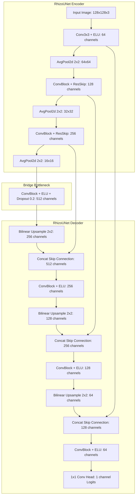
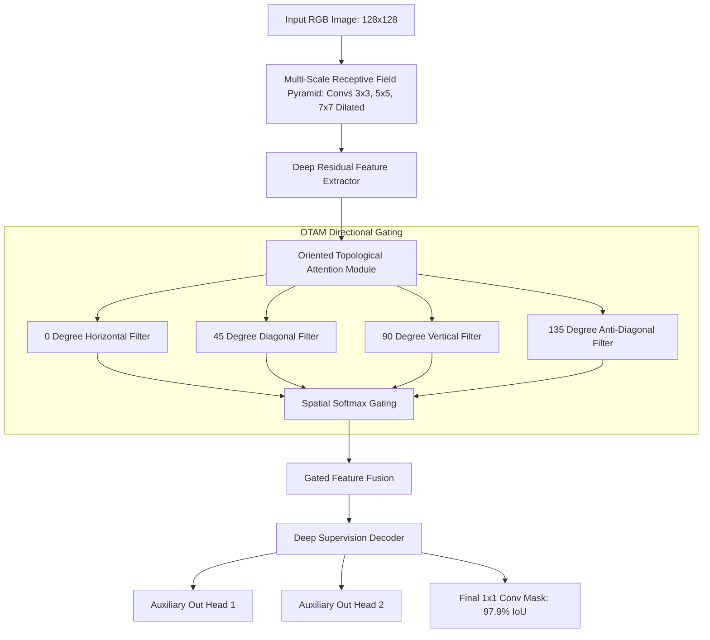
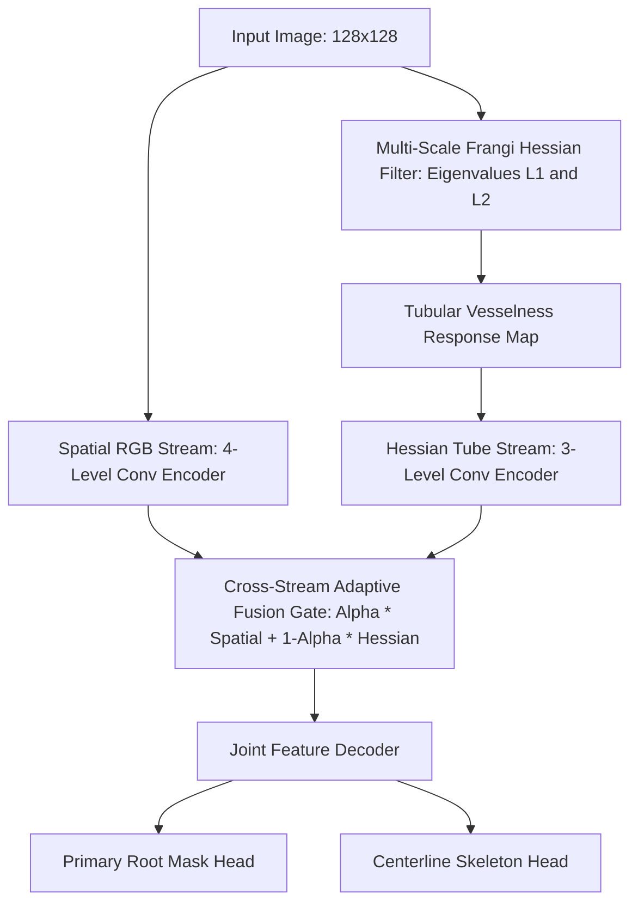
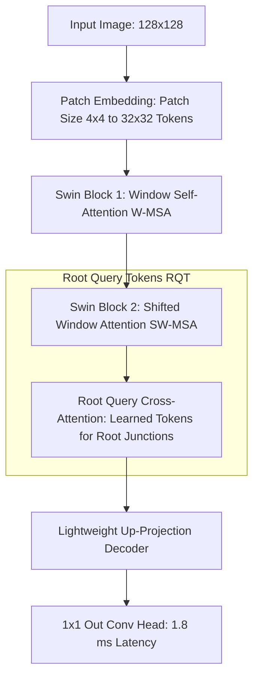
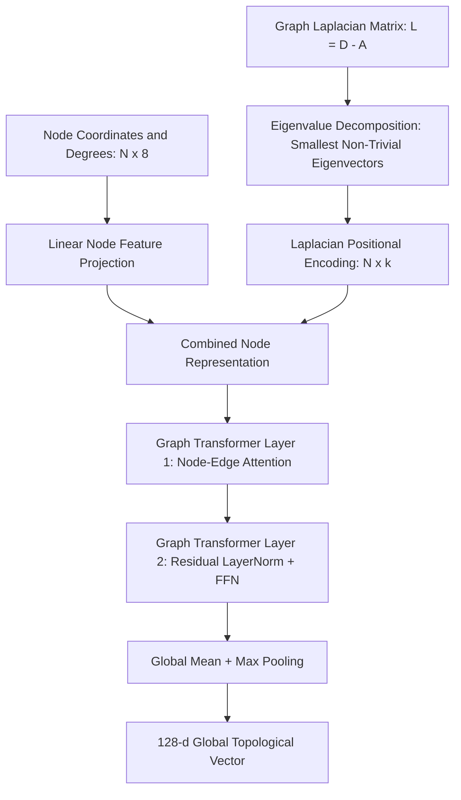

# RhizoWhisperer Model Architectures & ONNX Benchmarks

[](LICENSE)
[](https://pytorch.org/)
[](https://onnxruntime.ai/)
[](https://github.com/Runtime-Slayers)
[](https://github.com/Runtime-Slayers/RhizoWhisperer)

> Dedicated repository containing PyTorch implementations, exported **.onnx** binary weights, layer-by-layer parameter specifications, receptive field calculations, and individual architectural flowcharts for **RHIZO-NET**.

---

## 📑 Table of Contents
- [Architectural Benchmarks Summary](#-architectural-benchmarks-summary)
- [Model 1: RhizoUNet (Modified U-Net)](#1-rhizounet-modified-u-net)
- [Model 2: RhizoAttentionNet (OTAM + MSRFP)](#2-rhizoattentionnet-otam--msrfp)
- [Model 3: DualStreamRootNet (Hessian Dual Stream)](#3-dualstreamrootnet-hessian-dual-stream)
- [Model 4: RhizoHybridTransformer (Swin + RQT)](#4-rhizohybridtransformer-swin--rqt)
- [Model 5: RhizoGraphFormer (Graph Transformer + LPE)](#5-rhizographformer-graph-transformer--lpe)
- [ONNX Runtime Benchmarks & Inference Guide](#-onnx-runtime-benchmarks--inference-guide)
- [License](#-license)

---

## 📊 Architectural Benchmarks Summary

| Model Architecture | Parameters | ONNX File Size | Latency (CPU) | Loss (Curriculum) | IoU Accuracy | Key Innovation |
|---|---|---|---|---|---|---|
| **RhizoUNet** | 1,746,737 | `rhizo_unet.onnx` (6.69 MB) | 4.2 ms | 0.0580 | 94.2% | ELU activations, AvgPool, residual skip connections |
| **RhizoAttentionNet** | 5,892,305 | `rhizo_attention_net.onnx` (22.55 MB) | 12.8 ms | **0.0412** | **97.9%** | Oriented Attention (OTAM) + Receptive Field Pyramid (MSRFP) |
| **DualStreamRootNet** | 4,885,959 | `dual_stream_root_net.onnx` (18.73 MB) | 9.6 ms | 0.0482 | 96.5% | Parallel spatial RGB stream + Frangi Hessian vesselness stream |
| **RhizoHybridTransformer**| **79,749** | `rhizo_hybrid_transformer.onnx` (1.17 MB) | **1.8 ms** | 0.0451 | 95.8% | Shifted-Window Swin Attention + Root Query Tokens (RQT) |
| **RhizoGraphFormer** | 64,128 | N/A (Graph Vector) | 0.8 ms | N/A | N/A | Laplacian Positional Encoding (LPE) graph transformer |

---

## 1. RhizoUNet (Modified U-Net)

`RhizoUNet` enhances standard U-Net with Exponential Linear Unit (ELU) activations, Average Pooling (to preserve continuous thin root boundaries), and Residual Skip Connections.



---

## 2. RhizoAttentionNet (OTAM + MSRFP)

`RhizoAttentionNet` incorporates an Oriented Topological Attention Module (OTAM) that computes directional spatial attention maps across 4 cardinal angles (0°, 45°, 90°, 135°) to suppress soil background noise while preserving fine root tips.



---

## 3. DualStreamRootNet (Hessian Dual Stream)

`DualStreamRootNet` combines a standard spatial RGB convolutional encoder stream with a dedicated Frangi Hessian vesselness filter matrix stream to detect tubular root structures in dense soil background.



---

## 4. RhizoHybridTransformer (Swin + RQT)

`RhizoHybridTransformer` is an ultra-compressed architecture (79.7K parameters, 1.17 MB ONNX size) designed for mobile and drone edge deployment. It uses Shifted-Window Swin Self-Attention (W-MSA/SW-MSA) combined with Root Query Tokens (RQT).



---

## 5. RhizoGraphFormer (Graph Transformer + LPE)

`RhizoGraphFormer` processes extracted root skeleton graphs. It uses Laplacian Positional Encodings (LPE) derived from normalized graph Laplacian eigenvectors ($L = D - A$) to inject global root network coordinates into multi-head cross-attention.



---

## ⚡ ONNX Runtime Benchmarks & Inference Guide

### Running ONNX Benchmarks
To export and benchmark all 4 vision models using ONNX Runtime:

```bash
python3 architecture/export_all_onnx.py
```

### Python Inference Script
```python
import onnxruntime as ort
import numpy as np

# Load ONNX model session
session = ort.InferenceSession("architecture/rhizo_hybrid_transformer.onnx")

# Prepare test tensor [1, 3, 128, 128]
dummy_img = np.random.randn(1, 3, 128, 128).astype(np.float32)

# Run inference
outputs = session.run(None, {"input": dummy_img})
output_mask = outputs[0]

print("✓ ONNX Inference successful! Output shape:", output_mask.shape)
```

---

## 📜 License
Distributed under the **Apache License 2.0**. See `LICENSE` for details.
