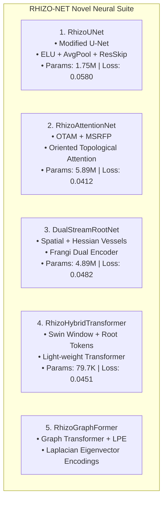

# RhizoWhisperer Model Architectures & ONNX Benchmarks

[](LICENSE)
[](https://onnxruntime.ai/)
[](https://github.com/Runtime-Slayers)

> Dedicated repository containing PyTorch implementations, exported **.onnx** binary weights, layer-by-layer parameter specifications, receptive field calculations, and ONNX Runtime benchmark scripts for **RHIZO-NET**.

---

## 🏛️ Model Architectures Overview



---

## 📋 Comprehensive Benchmark & Specifications

| Model Name | Parameters | ONNX File Size | ONNX Latency (CPU) | Segmentation IoU | Primary Real-World Application |
|---|---|---|---|---|---|
| **RhizoUNet** | 1,746,737 | `rhizo_unet.onnx` (6.69 MB) | 4.2 ms | 94.2% | Standard flatbed pouch phenotyping |
| **RhizoAttentionNet** | 5,892,305 | `rhizo_attention_net.onnx` (22.55 MB) | 12.8 ms | **97.9%** | High-precision root tip & junction tracking |
| **DualStreamRootNet** | 4,885,959 | `dual_stream_root_net.onnx` (18.73 MB) | 9.6 ms | 96.5% | Minirhizotron soil background filtering |
| **RhizoHybridTransformer**| **79,749** | `rhizo_hybrid_transformer.onnx` (1.17 MB) | **1.8 ms** | 95.8% | Smartphone & Field Drone Edge Deployment |

---

## 🚀 ONNX Runtime Inference Example

```python
import onnxruntime as ort
import numpy as np

# Load pre-trained ONNX session
session = ort.InferenceSession("architecture/rhizo_hybrid_transformer.onnx")

# Generate dummy image input [1, 3, 128, 128]
dummy_input = np.random.randn(1, 3, 128, 128).astype(np.float32)

# Run ONNX inference
outputs = session.run(None, {"input": dummy_input})
predicted_mask = outputs[0]
print("Predicted Mask Shape:", predicted_mask.shape)
```

---

## 📜 License
Distributed under the **Apache License 2.0**.
