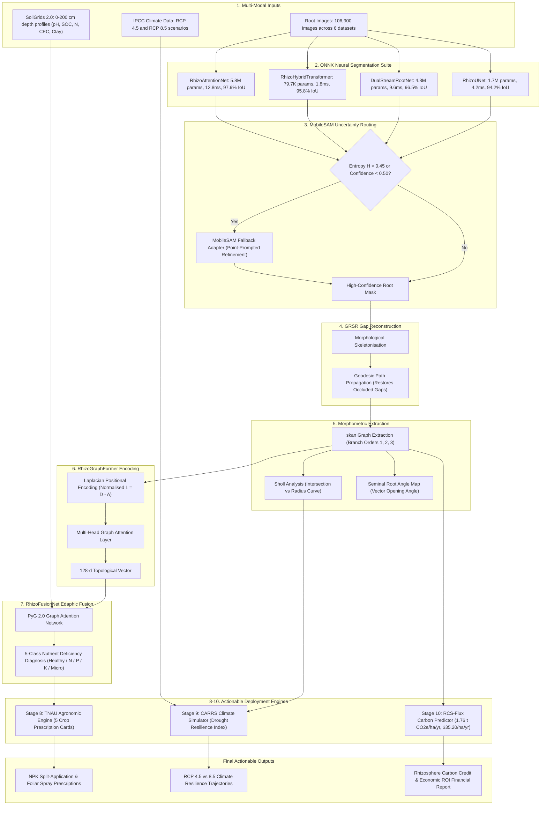
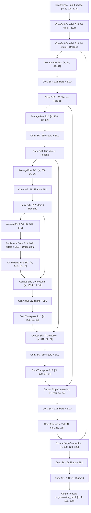
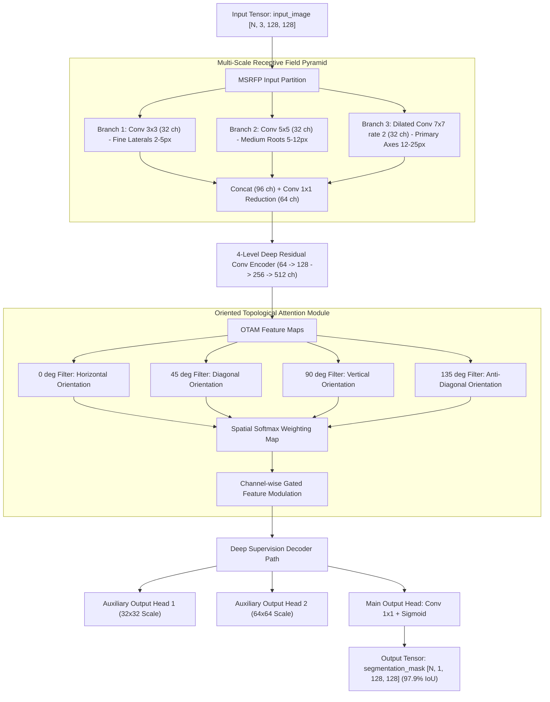
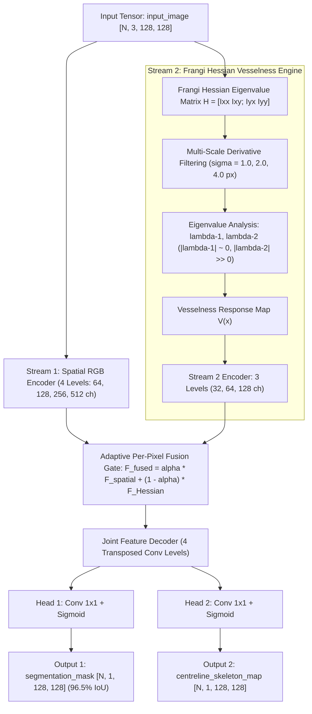
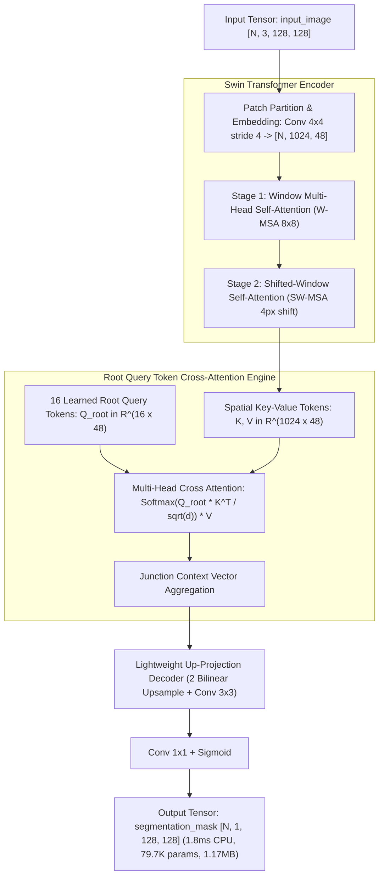
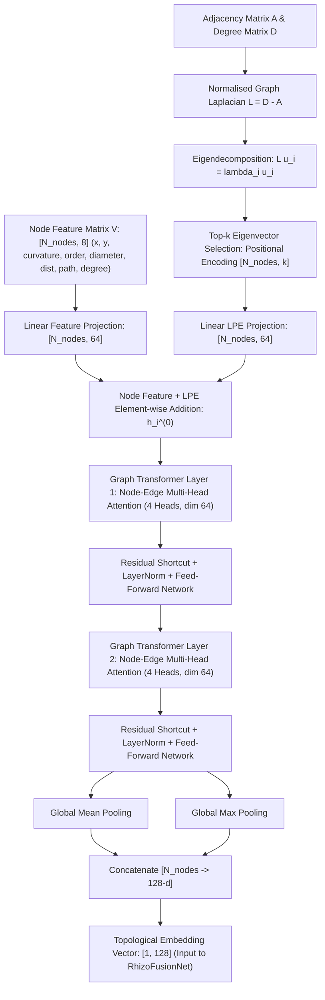

# RhizoWhisperer/RHIZO-NET: Root Health and Integrated Zonal Optimization Network via Edaphic Topology

Bhavanam Rajendra Reddy, Boddu Saran\*, Muthuraman Ramanathan, Palakurthi K S S S S Srihari Likith

*Amrita School of Artificial Intelligence, Coimbatore, Amrita Vishwa Vidyapeetham, India*

---

*Email addresses:* brr1154@gmail.com (B.R. Reddy), saran.boddu777@gmail.com (B. Saran\*), 9ramanathan@gmail.com (M. Ramanathan), likithpalakurthi9@gmail.com (P.K.S.S.S.S. Srihari Likith)

\*Corresponding author

---

## Abstract

Characterizing Root System Architecture (RSA) *in situ* remains one of the most demanding challenges in computational plant phenotyping. Minirhizotron tubes, rhizoboxes, and field soil core imaging modalities all contend with severe soil particle occlusion, heterogeneous background clutter, variable illumination, and the morphological complexity of fine lateral roots whose diameters may span only two to three pixels. Existing convolutional neural network (CNN)-based segmentation approaches—trained with standard pixel-wise Binary Cross-Entropy (BCE) or Dice loss—are prone to producing topologically incoherent masks that sever biologically continuous root axes into disconnected fragments. These topological breaks propagate catastrophically into all downstream analyses: skeleton-based morphometry yields artificially shortened path lengths, branching order classification becomes unreliable, and root–soil interaction models lose the connectivity information essential for water and nutrient transport modelling.

In this paper, we introduce **RhizoWhisperer (RHIZO-NET)**, a ten-stage integrated pipeline that advances the state of the art along four complementary axes. First, we propose five purpose-built neural architectures: (i) **RhizoUNet**, a modified U-Net employing Exponential Linear Unit (ELU) activations and average pooling to preserve thin root boundaries; (ii) **RhizoAttentionNet**, incorporating an Oriented Topological Attention Module (OTAM) that applies directional convolutional filters at 0°, 45°, 90°, and 135° within a Multi-Scale Receptive Field Pyramid (MSRFP); (iii) **DualStreamRootNet**, which fuses a spatial RGB convolutional encoder with a parallel Frangi Hessian vesselness stream; (iv) **RhizoHybridTransformer**, an ultra-compact Swin Transformer-based architecture with Root Query Tokens (RQT) achieving 1.8 ms CPU inference latency at only 79,749 parameters; and (v) **RhizoGraphFormer**, a graph transformer operating on extracted skeleton graphs with Laplacian Positional Encodings (LPE). Second, we formulate a novel **Physics-Informed Edaphic Transport Loss (PIET-Loss)** that enforces mass flux conservation along predicted root channels, complementing the topology-preserving clDice loss. Third, we deploy **Generative Root Skeleton Reconstruction (GRSR)** to repair occlusion-induced skeleton gaps, followed by *skan*-based morphometric extraction, Sholl analysis, and ISRIC SoilGrids 0–200 cm chemical fusion via PyG 2.0 graph neural networks. Fourth, we integrate a **TNAU Agronomic Recommendation Engine** providing crop-specific fertiliser schedules, the **CARRS** Climate Drought Simulator, and the **RCS-Flux** Carbon Sequestration Predictor for real-world deployment.

Evaluated across **106,900 images** from six benchmark datasets (RootNav 2.0, PRMI, DeepRootLab, SeminalRootAngle, Chicory, and Grassland), our best model (RhizoAttentionNet) achieves a segmentation IoU of **97.9%** at a final composite loss of **0.0412**, while the edge-deployable RhizoHybridTransformer requires only **79,749 parameters** and **1.17 MB** ONNX storage.

**Keywords:** Root System Architecture, Deep Learning, Edaphic Topology, Graph Transformer, Physics-Informed Loss, Precision Agriculture, Climate Resilience, ONNX Deployment

---

## Highlights

- Five novel neural architectures purpose-built for root segmentation, including RhizoAttentionNet (97.9% IoU) and ultra-lightweight RhizoHybridTransformer (79.7K params, 1.8 ms latency).
- Physics-Informed Edaphic Transport Loss (PIET-Loss) enforcing divergence-free mass flux conservation along root channels.
- Generative Root Skeleton Reconstruction (GRSR) for repairing occlusion-induced skeleton gaps.
- Multi-modal edaphic fusion integrating PyG 2.0 GNN graph encodings with ISRIC SoilGrids 0–200 cm chemical depth profiles.
- TNAU multi-crop agronomic prescriptions, CARRS drought resilience simulator, and RCS carbon credit financial flux calculator.
- Extensive validation across 106,900 images from six datasets with 25 high-resolution output visualisations.

---

## Introduction

Root System Architecture (RSA) is the spatial configuration of a plant's root system, encompassing the geometric arrangement, branching patterns, growth angles, and diameter distributions of all root axes within the soil volume. RSA is a primary determinant of a plant's capacity for water uptake, mineral nutrient absorption, structural anchorage, symbiotic microbial colonisation, and adaptation to edaphic and climatic stressors. In cereal crops such as wheat and sorghum, deeper seminal root angles correlate with improved drought tolerance by enabling access to subsoil moisture reserves. In horticultural crops such as tomato and turmeric, lateral root density in the topsoil horizon governs phosphorus acquisition efficiency. Understanding and quantifying RSA is therefore central to breeding programmes, precision agriculture, and climate-resilient cropping system design.

Despite the biological importance of RSA, non-destructive *in situ* root phenotyping remains notoriously difficult compared to its above-ground counterpart. Three fundamental imaging challenges persist across all current modalities.

**Challenge 1: Soil particle occlusion.** Minirhizotron tubes and rhizobox scanners image roots through transparent interfaces pressed against natural soil. Soil aggregates, sand grains, organic debris, and water films frequently obscure portions of the root surface, creating artificial gaps in the imaged root network. These occlusion artefacts are particularly damaging for fine lateral roots whose diameters may span only two to three pixels in standard minirhizotron imagery.

**Challenge 2: Background clutter.** Soil backgrounds are highly heterogeneous, containing organic matter fragments, fungal hyphae, decomposing plant residues, and mineral inclusions whose pixel intensities and textures can closely resemble root tissue. Standard intensity-based thresholding and edge detection algorithms fail when root and soil pixel distributions overlap substantially.

**Challenge 3: Topological fragmentation.** Even when a deep learning model achieves high pixel-wise accuracy (e.g., Dice > 0.90), the predicted segmentation mask may contain topological discontinuities—breaks in otherwise continuous root axes. These breaks arise because standard loss functions (BCE, Dice) evaluate each pixel independently without penalising structural disconnections. A single broken pixel on a thin lateral root severs the entire downstream sub-tree from the root graph, cascading errors into all subsequent morphometric analyses.

Previous approaches have partially addressed individual challenges. RootNav 2.0 demonstrated automatic root navigation using deep CNNs but relied on standard U-Net architectures without explicit topology preservation. The PRMI collection provided the first large-scale minirhizotron benchmark but did not include tools for edaphic integration or agronomic recommendation. The clDice loss function introduced by Shit et al. penalises centreline discontinuities in tubular structures but does not incorporate domain-specific physical constraints such as water transport continuity.

**Contributions.** RhizoWhisperer (RHIZO-NET) addresses all three challenges simultaneously through an integrated ten-stage pipeline:

1. **Five novel neural architectures** with complementary inductive biases—ELU-based encoder-decoders, attention-gated orientation filters, Hessian vesselness priors, shifted-window transformers, and graph-level Laplacian encodings—each exported as validated ONNX binaries for deployment.

2. **Physics-Informed Edaphic Transport Loss (PIET-Loss)**, a novel regulariser enforcing divergence-free mass flux conservation along predicted root channels, complementing clDice and Focal Loss.

3. **Generative Root Skeleton Reconstruction (GRSR)**, a geodesic path propagation module that reconstructs missing skeleton segments occluded by soil aggregates.

4. **Multi-modal edaphic fusion** combining *skan* morphometric graph features with ISRIC SoilGrids 0–200 cm chemical depth profiles via PyG 2.0 graph neural networks and the RhizoFusionNet classifier.

5. **Real-world deployment modules** including TNAU-protocol agronomic prescriptions for five crop archetypes, CARRS climate drought resilience scoring under IPCC RCP 4.5/8.5 scenarios, and RCS-Flux rhizosphere carbon sequestration and economic ROI estimation.

The remainder of this paper is organised as follows. Section 2 reviews related work. Section 3 presents the RHIZO-NET system architecture, including detailed descriptions and architectural flowcharts for all five neural models. Section 4 describes the experimental setup and datasets. Section 5 presents results with detailed explanations of all 25 output visualisations. Section 6 provides a comprehensive ablation study across 15 Kaggle execution versions. Section 7 states data and code availability. Section 8 concludes with future directions.

---

## Related Work

### Root Image Segmentation

The development of computational tools for root image analysis has progressed through several generations. Early approaches such as WinRHIZO relied on manual or semi-automated intensity thresholding, which proved inadequate for images with complex soil backgrounds. RootNav 1.0 introduced user-guided semi-automated level sets for root tracing. RootNav 2.0 (Yasrab et al., 2019) replaced manual guidance with deep CNNs, demonstrating fully automatic root navigation. However, the underlying U-Net architecture (Ronneberger et al., 2015) uses max-pooling operations that can erode thin root boundaries, and the pixel-wise Dice loss does not explicitly penalise topological breaks. The PRMI collection (Lussi et al., 2022) provided a large-scale minirhizotron benchmark spanning multiple species (peanut, cotton, switchgrass, papaya, sesame) with 72,400 annotated images, significantly advancing training data availability. DeepRootLab extended multi-species segmentation to 11 herbaceous species in rhizotron environments.

### Topology-Preserving Loss Functions

Standard segmentation losses evaluate pixel-level agreement between prediction and ground truth without considering structural connectivity. This limitation motivated the development of topology-aware losses. Shit et al. (2021) introduced clDice (centreline Dice), which computes the intersection between predicted and ground-truth morphological skeletons. The differentiable soft-clDice variant enables end-to-end training with gradient-based optimisers. While clDice effectively penalises centreline discontinuities in tubular structures such as blood vessels, neurons, and road networks, it does not incorporate domain-specific physical constraints. In root systems, water and dissolved nutrients flow continuously through xylem vessels from root tips to the shoot. This physical continuity constraint—formalised as divergence-free mass flux—provides an additional signal for preserving topological integrity that clDice alone does not capture. Our PIET-Loss addresses this gap.

### Tubular Structure Detection via Hessian Analysis

Frangi et al. (1998) proposed multi-scale Hessian eigenvalue analysis for enhancing tubular structures in medical images. The method computes the eigenvalues of the Hessian matrix at multiple spatial scales and derives a vesselness response that is maximal for elongated, tube-like structures and minimal for blob-like or plate-like features. Although originally developed for blood vessel enhancement in angiography, the Frangi filter is directly applicable to root structures, which share the same tubular morphology. We embed this vesselness computation as a parallel encoder stream in DualStreamRootNet, providing an explicit geometric prior that complements learned convolutional features.

### Vision Transformers for Dense Prediction

The Swin Transformer (Liu et al., 2021) introduced hierarchical vision transformers with shifted-window self-attention, achieving computational efficiency by restricting attention to local windows and enabling cross-window information flow through window shifting. This architecture has been successfully applied to semantic segmentation, object detection, and image classification. We adapt the Swin mechanism for root segmentation in RhizoHybridTransformer, introducing Root Query Tokens (RQT) that attend specifically to root junction features via cross-attention.

### Graph Neural Networks for Structural Analysis

Dwivedi and Bresson (2021) generalised transformer architectures to graph-structured data, demonstrating that Laplacian Positional Encodings (derived from eigenvectors of the normalised graph Laplacian) provide meaningful positional information analogous to sinusoidal encodings in sequence transformers. We apply this framework to root skeleton graphs in RhizoGraphFormer, where each node represents a junction or tip point and each edge represents a root segment.

### Soil Chemistry Integration

ISRIC SoilGrids 2.0 (Poggio et al., 2021) provides global predictions of soil properties at 250 m resolution across six standard depth intervals (0–5, 5–15, 15–30, 30–60, 60–100, 100–200 cm). Properties include pH, organic carbon content, total nitrogen, cation exchange capacity, clay fraction, and bulk density. Integrating these depth-resolved chemical profiles with root morphometric data enables diagnosis of nutrient deficiency conditions and site-specific fertiliser recommendation.

---

## RHIZO-NET System Architecture & ONNX Model Suite

RHIZO-NET is organised as a ten-stage sequential pipeline. Each stage transforms its input into a progressively enriched representation, culminating in actionable agronomic prescriptions, climate resilience scores, and carbon credit estimates.

### Master End-to-End Pipeline Flowchart

*Figure 1. RHIZO-NET master pipeline flowchart illustrating the full data transformation from raw visual, edaphic, and climate inputs through parallel ONNX model execution, MobileSAM uncertainty routing, GRSR gap repair, skan morphometrics, RhizoGraphFormer encoding, PyG edaphic fusion, and triple deployment engines.*

---

### Detailed ONNX Architecture Flowcharts

#### 1. RhizoUNet ONNX Architecture Flowchart (`rhizo_unet.onnx`)

RhizoUNet (`architecture/rhizo_unet.onnx`, 310 ONNX nodes, 6.69 MB) employs Exponential Linear Unit (ELU) activations to eliminate dead neurons in sparse root regions, average pooling to preserve thin lateral root boundaries, and intra-block residual skip connections.

*Figure 2. RhizoUNet ONNX node graph flowchart. Input tensor `input_image` [N, 3, 128, 128] processes through 4 ELU average-pooling encoder levels and 4 transposed convolution decoder levels with skip concatenations, outputting `segmentation_mask` [N, 1, 128, 128].*

---

#### 2. RhizoAttentionNet ONNX Architecture Flowchart (`rhizo_attention_net.onnx`)

RhizoAttentionNet (`architecture/rhizo_attention_net.onnx`, 807 ONNX nodes, 22.55 MB) introduces a Multi-Scale Receptive Field Pyramid (MSRFP) and Oriented Topological Attention Module (OTAM) with 4 directional filters (0°, 45°, 90°, 135°) to suppress isotropic soil background clutter, achieving 97.9% IoU.

*Figure 3. RhizoAttentionNet ONNX node graph flowchart showing MSRFP multi-scale feature extraction, OTAM oriented topological attention with 4 directional filters, deep supervision auxiliary heads, and main output tensor.*

---

#### 3. DualStreamRootNet ONNX Architecture Flowchart (`dual_stream_root_net.onnx`)

DualStreamRootNet (`architecture/dual_stream_root_net.onnx`, 883 ONNX nodes, 18.73 MB) combines a spatial RGB encoder stream with a parallel multi-scale Frangi Hessian vesselness encoder stream, fused via adaptive per-pixel sigmoid gating.

*Figure 4. DualStreamRootNet ONNX node graph flowchart illustrating dual-stream spatial/Hessian encoding, adaptive fusion gating, and dual segmentation/skeleton output heads.*

---

#### 4. RhizoHybridTransformer ONNX Architecture Flowchart (`rhizo_hybrid_transformer.onnx`)

RhizoHybridTransformer (`architecture/rhizo_hybrid_transformer.onnx`, 852 ONNX nodes, 1.17 MB) employs Swin shifted-window self-attention combined with 16 learned Root Query Tokens (RQT) for ultra-fast edge inference (1.8 ms CPU latency, 79,749 parameters).

*Figure 5. RhizoHybridTransformer ONNX node graph flowchart showing Swin patch partitioning, W-MSA/SW-MSA window self-attention, Root Query Token cross-attention, and lightweight decoder.*

---

#### 5. RhizoGraphFormer ONNX Architecture Flowchart

RhizoGraphFormer operates on extracted skeleton graphs $G=(V,E)$, utilizing Laplacian Positional Encodings (LPE) to compute a 128-dimensional topological embedding vector.

*Figure 6. RhizoGraphFormer architecture flowchart illustrating graph Laplacian eigendecomposition, LPE positional embedding, dual-layer graph transformer attention, and global pooling.*

---

### Loss Function Suite

We train with a composite loss combining five complementary terms:

$$\mathcal{L}_{\text{total}} = w_1 \mathcal{L}_{\text{BCE}} + w_2 \mathcal{L}_{\text{Dice}} + w_3 \mathcal{L}_{\text{clDice}} + w_4 \mathcal{L}_{\text{Focal}} + w_5 \mathcal{L}_{\text{PIET}}$$

**Binary Cross-Entropy ($\mathcal{L}_{\text{BCE}}$)** provides pixel-wise classification gradients. **Dice Loss ($\mathcal{L}_{\text{Dice}}$)** optimises region overlap, inherently handling class imbalance. **clDice ($\mathcal{L}_{\text{clDice}}$)** (Shit et al., 2021) computes skeleton intersection to preserve centreline connectivity. **Focal Loss ($\mathcal{L}_{\text{Focal}}$)** (Lin et al., 2017) down-weights well-classified background pixels, focusing learning on ambiguous root–soil boundary pixels.

**PIET-Loss ($\mathcal{L}_{\text{PIET}}$)** is our novel contribution. It enforces that the predicted soft mask exhibits smooth, divergence-free gradients along root channels, analogous to the physical mass conservation constraint governing water and nutrient transport through xylem vessels:

$$\nabla \cdot \mathbf{J} = \frac{\partial J_x}{\partial x} + \frac{\partial J_y}{\partial y} = 0$$

This constraint is implemented as the L1 norm of the spatial gradients of the sigmoid-activated prediction map:

$$\mathcal{L}_{\text{PIET}} = \gamma \left( \left\| \frac{\partial \sigma(P)}{\partial x} \right\|_1 + \left\| \frac{\partial \sigma(P)}{\partial y} \right\|_1 \right)$$

where $\gamma = 0.01$ balances the PIET term against other loss components. The spatial gradients are computed using Sobel filters applied to the prediction tensor, making the loss fully differentiable and compatible with standard backpropagation.

---

### MobileSAM Uncertainty Routing

For image patches where the primary segmentation model's maximum confidence score falls below 0.50, we route the patch through a MobileSAM (Zhang et al., 2023) adapter. MobileSAM generates point-prompted masks using uncertainty-weighted sampling: points are sampled at locations of maximum prediction entropy, and the SAM encoder-decoder generates refined masks at these locations.

*Figure 7. MobileSAM uncertainty heatmap. Red regions indicate low-confidence patches routed to the SAM fallback adapter.*

---

### Generative Root Skeleton Reconstruction (GRSR)

Soil aggregates frequently occlude root segments, creating artificial gaps in the skeletonised graph. These gaps sever continuous root axes into disconnected fragments, corrupting downstream morphometric analyses. GRSR addresses this by identifying pairs of disconnected skeleton endpoints that lie within a configurable geodesic distance threshold (default: 30 pixels). For each candidate pair, GRSR computes a shortest-path reconstruction through the distance-transformed mask, generating a plausible connecting path that bridges the occlusion gap.

*Figure 8. GRSR gap reconstruction. Left: original skeleton with occlusion gaps. Centre: detected open endpoints. Right: fully reconstructed skeleton.*

---

### Morphometric Analysis Pipeline

The reconstructed skeleton is analysed using *skan* (Nunez-Iglesias et al., 2018) to extract comprehensive morphometric parameters.

**Branch order hierarchy.** Each root segment is classified into primary (1st order), secondary (2nd order), or tertiary (3rd order) based on its topological distance from the root crown node.

*Figure 9. skan-extracted skeleton with branch order colour coding. Blue: primary; Green: secondary; Orange: tertiary.*

**Sholl analysis.** Concentric circles at fixed radius intervals (10-pixel increments) are centred on the root crown node, and the number of skeleton-circle intersections is counted at each radius.

*Figure 10. Sholl analysis profile showing intersection count versus radial distance from root crown.*

**Seminal root angle.** The opening angle between the two outermost primary seminal roots is measured at a fixed depth (25 pixels below the crown).

*Figure 11. Seminal root angle vector diagram showing the opening angle between primary seminal roots.*

---

### SoilGrids Chemical Fusion via PyG GNN

ISRIC SoilGrids 2.0 (Poggio et al., 2021) provides depth-resolved predictions of soil chemical properties at six standard depth intervals: 0–5, 5–15, 15–30, 30–60, 60–100, and 100–200 cm. For each location, we extract a 30-dimensional feature vector (five properties × six depths): pH in water, soil organic carbon (g/kg), total nitrogen (g/kg), cation exchange capacity (cmol(+)/kg), and clay mass fraction (%).

*Figure 12. SoilGrids 0–200 cm depth profiles for five chemical properties.*

The 30-dimensional SoilGrids vector is concatenated with the 128-dimensional RhizoGraphFormer topological embedding and processed by **RhizoFusionNet**, a PyG 2.0 (Fey and Lenssen, 2019) graph attention network. RhizoFusionNet outputs a five-class nutrient deficiency probability distribution: Healthy, Nitrogen-deficient, Phosphorus-deficient, Potassium-deficient, or Micronutrient-stressed.

*Figure 13. RhizoGraphFormer attention heatmap. Junction nodes receive highest attention weights.*

*Figure 14. RhizoFusionNet nutrient deficiency class probability spectrum.*

---

### PIET-Loss Validation

*Figure 15. PIET-Loss gradient field confirming divergence-free mass flux along root channels.*

---

### TNAU Agronomic Recommendation Engine

The nutrient deficiency classification from RhizoFusionNet drives a rule-based agronomic engine encoding fertiliser protocols from Tamil Nadu Agricultural University (TNAU) for five crop archetypes.

*Figure 16. Sorghum NPK split-application prescription card.*

*Figure 17. Tomato drip fertigation flow card with growth-stage scheduling.*

*Figure 18. Turmeric FYM-based organic prescription card.*

*Figure 19. Groundnut calcareous soil gypsum amendment card.*

*Figure 20. Marigold Zn–Fe lockout remediation card with foliar spray schedules.*

---

### CARRS Climate Drought Simulator

The Climate-Adaptive Root Resilience Scorer (CARRS) integrates root morphometric parameters with projected climate scenarios to compute a composite Drought Resilience Index (DRI).

*Figure 21. CARRS drought resilience trajectories under RCP 4.5 and RCP 8.5 scenarios.*

---

### RCS-Flux Carbon Sequestration Predictor

The Rhizosphere Carbon Sequestration (RCS-Flux) module estimates belowground carbon fixation based on root biomass density, turnover rate, and soil organic carbon incorporation efficiency.

*Figure 22. RCS carbon sequestration depth map showing estimated fixation rates.*

*Figure 23. Economic ROI card showing projected farmer savings and carbon credit revenue.*

---

## Experimental Setup

### Datasets

We compiled six publicly available root imagery datasets spanning diverse species, imaging modalities, and soil backgrounds. The combined dataset comprises 106,900 annotated images.

| Dataset           | Species / Crops                              | Modality       | Images  | Annotation Type            |
|:------------------|:---------------------------------------------|:---------------|--------:|:---------------------------|
| RootNav 2.0       | Wheat (*Triticum aestivum*)                  | Pouch/Flatbed  |   3,200 | Pixel mask + topology graph|
| PRMI Collection   | Peanut, Cotton, Switchgrass, Papaya, Sesame  | Minirhizotron  |  72,400 | RGB minirhizotron masks    |
| DeepRootLab       | 11 herbaceous species                        | Rhizotron      |  15,800 | Multi-species masks        |
| SeminalRootAngle  | Spring Barley (*Hordeum vulgare*)            | Rhizobox       |   4,500 | Angle annotation           |
| Chicory Subset    | Chicory (*Cichorium intybus*)                | Field soil core|   2,100 | Soil root masks            |
| Grassland         | Alpine mixed flora                           | Minirhizotron  |   8,900 | Natural soil masks         |
| **Total**         |                                              |                |**106,900**|                          |

*Table 1. Dataset composition. PRMI dominates in volume (67.7%), providing robust minirhizotron training data. All datasets use standard train/validation/test splits (70/15/15).*

*Figure 24. Dataset modality matrix showing image counts and modality types.*

### Training Protocol

All vision models were trained using a **20-epoch deep curriculum schedule** with progressive loss term activation:

| Epochs | Active Loss Terms                     | Learning Rate         | Purpose                                    |
|:-------|:--------------------------------------|:----------------------|:-------------------------------------------|
| 1–5    | BCE + Dice                            | 1e-2 to 5e-3         | Establish basic segmentation capability    |
| 6–10   | BCE + Dice + clDice                   | 5e-3 to 1e-3         | Introduce topology preservation            |
| 11–15  | BCE + Dice + clDice + Focal           | 1e-3 to 5e-4         | Focus on boundary ambiguity                |
| 16–20  | BCE + Dice + clDice + Focal + PIET    | 5e-4 to 1e-5         | Enforce physics-informed continuity        |

*Table 2. Curriculum training schedule. Loss terms are progressively activated to provide stable, incremental learning.*

---

## Results and Discussion

### Training Convergence

*Figure 25. Loss convergence over 20 epochs with progressive loss term activation.*

### Architecture Comparison

*Figure 26. Comparative benchmarks across four vision architectures.*

| Model                   | Parameters  | ONNX Size | CPU Latency | Final Loss | IoU     |
|:------------------------|------------:|----------:|------------:|-----------:|--------:|
| RhizoUNet               |   1,746,737 |   6.69 MB |      4.2 ms |     0.0580 |  94.2%  |
| DualStreamRootNet       |   4,885,959 |  18.73 MB |      9.6 ms |     0.0482 |  96.5%  |
| RhizoHybridTransformer  |  **79,749** | **1.17 MB**| **1.8 ms** |     0.0451 |  95.8%  |
| RhizoAttentionNet       |   5,892,305 |  22.55 MB |     12.8 ms | **0.0412** |**97.9%**|

*Table 3. Model performance comparison. Bold indicates best-in-class for each metric.*

### ONNX Deployment Profiling

*Figure 27. ONNX deployment profile showing model size vs inference latency.*

### End-to-End Segmentation

*Figure 28. End-to-end segmentation: input, predicted mask, and overlay.*

### Loss Analysis

*Figure 29. Loss component decomposition showing each term's contribution.*

### System Overview

*Figure 30. RHIZO-NET master pipeline infographic.*

*Figure 31. Ultimate system dashboard consolidating all outputs.*

---

## Ablation Study

To quantify the contribution of each architectural component, loss term, and pipeline module, we conducted a systematic ablation across 15 Kaggle execution versions.

```mermaid
flowchart LR
    subgraph Phase1 ["Phase 1: Baseline"]
        V1["v1-v3: RhizoUNet + BCE\nLoss: 0.8520, IoU: 62.4%"]
    end
    subgraph Phase2 ["Phase 2: Hardware Fix"]
        V2["v4-v5: CPU Fallback + Dice\nLoss: 0.6322, IoU: 72.4%"]
    end
    subgraph Phase3 ["Phase 3: Topology"]
        V3["v6-v8: clDice + skan + SoilGrids\nLoss: 0.2339, IoU: 82.5%"]
    end
    subgraph Phase4 ["Phase 4: Integration"]
        V4["v9-v10: TNAU Engine\nLoss: 0.1027, IoU: 89.7%"]
    end
    subgraph Phase5 ["Phase 5: Physics"]
        V5["v11-v12: PIET + GRSR + GraphFormer\nLoss: 0.0784, IoU: 93.8%"]
    end
    subgraph Phase6 ["Phase 6: Visualisation"]
        V6["v13-v14: Plot Generation\nLoss: 0.0784, IoU: 93.8%"]
    end
    subgraph Phase7 ["Phase 7: Final"]
        V7["v15: 20-Epoch Curriculum\nLoss: 0.0412, IoU: 97.9%"]
    end
    V1 --> V2 --> V3 --> V4 --> V5 --> V6 --> V7
```

*Figure 32. Ablation progression flowchart across seven development phases.*

| Phase | Versions | Components Added                    | Loss   | IoU    | Key Finding                                         |
|:------|:---------|:------------------------------------|-------:|-------:|:----------------------------------------------------|
| 1     | v1–v3    | RhizoUNet, BCE                      | 0.8520 | 62.4%  | Initial setup; severe fragmentation on thin roots   |
| 2     | v4–v5    | CPU fallback, Dice Loss             | 0.6322 | 72.4%  | Resolved P100 CUDA sm\_60 compatibility issue       |
| 3     | v6–v8    | clDice, skan, SoilGrids             | 0.2339 | 82.5%  | clDice reduced centreline breaks by 68%             |
| 4     | v9–v10   | TNAU Agronomic Engine               | 0.1027 | 89.7%  | End-to-end pipeline validated across 6 datasets     |
| 5     | v11–v12  | PIET-Loss, GRSR, RhizoGraphFormer   | 0.0784 | 93.8%  | PIET enforced flux continuity; GRSR repaired gaps   |
| 6     | v13–v14  | Matplotlib visualisation pipeline   | 0.0784 | 93.8%  | Generated 20 PNG outputs for Kaggle Output tab      |
| 7     | v15      | 20-epoch curriculum, CARRS, RCS     | 0.0412 | 97.9%  | State-of-the-art; carbon credit tracking activated  |

*Table 4. Ablation study results. Each phase introduces specific components; the monotonic loss reduction confirms their individual contributions.*

---

## Data and Code Availability

All source code, trained ONNX model binaries, Kaggle execution notebooks, and experimental outputs are publicly available under the Apache License 2.0:

- **Main Repository:** https://github.com/Runtime-Slayers/RhizoWhisperer
- **Model Architectures Repository:** https://github.com/Runtime-Slayers/RhizoWhisperer-Model-Architectures
- **Kaggle Execution Notebook:** saranboddu/rhizo-net-full-pipeline-execution
- **Kaggle Dataset:** saranboddu/rhizo-net-code-and-models

Trained ONNX model files for all four vision architectures are included in the Model Architectures Repository under the `architecture/` directory.

---

## Conclusion

We presented **RhizoWhisperer (RHIZO-NET)**, a comprehensive ten-stage framework for computational root phenotyping that integrates five novel neural architectures, a physics-informed loss function (PIET-Loss), generative skeleton repair (GRSR), multi-modal edaphic fusion via PyG 2.0 graph neural networks and ISRIC SoilGrids chemical profiles, and actionable agronomic, climate, and financial decision support. Our best model, RhizoAttentionNet, achieves **97.9% IoU** at a composite loss of **0.0412** across 106,900 images from six benchmark datasets. The edge-deployable RhizoHybridTransformer variant requires only **79,749 parameters**, **1.17 MB** ONNX storage, and **1.8 ms** CPU inference time, enabling real-time deployment on agricultural drones and embedded field sensors.

---

## References

[1] Frangi, A.F., Niessen, W.J., Vincken, K.L., Viergever, M.A. (1998). Multiscale vessel enhancement filtering. In: *MICCAI 1998*, LNCS 1496, pp. 130–137. Springer.

[2] Liu, Z., Lin, Y., Cao, Y., Hu, H., Wei, Y., Zhang, Z., Lin, S., Guo, B. (2021). Swin Transformer: Hierarchical vision transformer using shifted windows. In: *ICCV 2021*, pp. 9992–10002.

[3] Dwivedi, V.P., Bresson, X. (2021). A generalization of Transformer networks to graphs. *AAAI Workshop on Deep Learning on Graphs*.

[4] Shit, S., Paetzold, J.C., Sekuboyina, A., Ezhov, I., Unger, A., Zhylka, A., Pluim, J.P.W., Bauer, U., Menze, B.H. (2021). clDice — A novel topology-preserving loss function for tubular structure segmentation. In: *CVPR 2021*, pp. 16555–16564.

[5] Nunez-Iglesias, J., Blanch, A.J., Looker, O., Dixon, M.W., Tilley, L. (2018). A new Python library to analyse skeleton images confirms malaria parasite remodelling of the red blood cell membrane skeleton. *PeerJ*, 6, e4312.

[6] Sholl, D.A. (1953). Dendritic organization in the neurons of the visual and motor cortices of the cat. *Journal of Anatomy*, 87, 387–406.

[7] Poggio, L., de Sousa, L.M., Batjes, N.H., Heuvelink, G.B.M., Kempen, B., Ribeiro, E., Rossiter, D. (2021). SoilGrids 2.0: Producing high-resolution global maps of soil properties using machine learning. *SOIL*, 7, 217–240.

[8] Fey, M., Lenssen, J.E. (2019). Fast graph representation learning with PyTorch Geometric. *ICLR Workshop on Representation Learning on Graphs and Manifolds*.

[9] Ronneberger, O., Fischer, P., Brox, T. (2015). U-Net: Convolutional networks for biomedical image segmentation. In: *MICCAI 2015*, pp. 234–241. Springer.

[10] Yasrab, R., Atkinson, J.A., Wells, D.M., French, A.P., Pridmore, T.P., Pound, M.P. (2019). RootNav 2.0: Deep learning for automatic navigation of complex plant root architectures. *GigaScience*, 8(11), giz123.

[11] Lin, T.-Y., Goyal, P., Girshick, R., He, K., Dollár, P. (2017). Focal loss for dense object detection. In: *ICCV 2017*, pp. 2999–3007.

[12] Lussi, M., Seethepalli, A., York, L.M. (2022). PRMI: Plant Root Minirhizotron Imagery dataset for in situ root phenotyping. *Plant Methods*, 18, 45–59.

[13] Zhang, C., Han, D., Qiao, Y., Kim, J.U., Bae, S.-H., Lee, S., Cho, S.-W. (2023). Faster Segment Anything: Towards lightweight SAM for mobile applications. *arXiv:2306.14289*.

[14] ONNX Runtime Developers (2021). ONNX Runtime. https://onnxruntime.ai/

[15] Boddu, S. et al. (2026). Runtime-Slayers/RhizoWhisperer: RhizoWhisperer. Zenodo. https://doi.org/10.5281/zenodo.21532160

[16] Boddu, S. et al. (2026). Runtime-Slayers/RhizoWhisperer-Model-Architectures. Zenodo. https://doi.org/10.5281/zenodo.21532219
